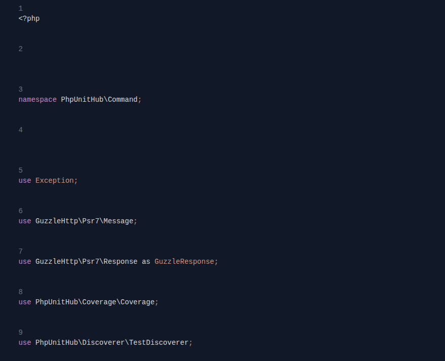

# PHPUnit Hub


PHPUnit Hub is a modern, real-time web interface for running and analyzing PHPUnit tests. It provides a local, self-contained server that discovers your tests, runs them, and displays the results in a clean and interactive web UI.

The entire application is powered by a PHP backend using the high-performance [ReactPHP](https://reactphp.org/) event loop, with a frontend built on [Vue.js](https://vuejs.org/) and [Tailwind CSS](https://tailwindcss.com/).



## Features

- **Real-Time Feedback**: Watch your tests run in real-time via WebSockets.
- **Test Explorer**: Automatically discovers your test suites and methods from your `phpunit.xml` configuration.
- **Interactive Filtering**: Click on a test in the explorer to filter the run, or write your own filter pattern.
- **Detailed Results**: View a clear summary of test outcomes and a detailed table of all test cases.
- **Failure Analysis**: Expand failed or errored tests to see the detailed stack trace and error messages.
- **Clean UI**: A modern, tabbed interface to switch between structured results and raw console output.
- **Self-Contained**: Runs with a simple command, no need for a separate web server like Nginx or Apache.

## Installation

TestRunUI is designed to be included as a development dependency in your PHP project.

1.  **Require with Composer**:
    Navigate to your project's root directory and run:
    ```sh
    composer require --dev raffaelecarelle/phpunit-hub
    ```

2.  **Ensure PHPUnit is configured**:
    TestRunUI requires a `phpunit.xml` or `phpunit.xml.dist` file in your project's root directory to discover your tests.

That's it! All dependencies will be installed automatically.

## Usage

1.  **Start the Server**:
    From your project's root directory, run the `serve` command:
    ```sh
    vendor/bin/phpunit-hub
    ```
    The server will start, and you will see a confirmation message:
    ```
    Starting server on http://127.0.0.1:8080
    API endpoint available at GET /api/tests
    API endpoint available at POST /api/run
    WebSocket server listening on /ws/status
    Serving static files from 'public' directory
    ```

2.  **Open the Web UI**:
    Open your web browser and navigate to **[http://127.0.0.1:8080](http://127.0.0.1:8080)**.

3.  **Run Your Tests**:
    - The **Test Explorer** on the left will show all the test suites and methods found in your project.
    - You can click on a specific test method to automatically set the filter.
    - Alternatively, you can type a custom filter pattern (as you would for `phpunit --filter`).
    - Click the **"Run Tests"** button to start the test execution.
    - Watch the **"Output"** tab for real-time progress, and see the final results in the **"Results"** tab.

## Contributing

Contributions are welcome! Whether it's a bug report, a new feature, or a documentation improvement, your help is appreciated. Please follow these steps to contribute:

1.  **Fork the Repository**:
    Create your own fork of the project on GitHub.

2.  **Create a Branch**:
    Create a new branch for your feature or bug fix.
    ```sh
    git checkout -b feature/my-awesome-feature
    ```

3.  **Make Your Changes**:
    Implement your changes and additions.

4.  **Run Tests**:
    Ensure that the existing test suite passes with your changes.
    ```sh
    # Install development dependencies
    composer install

    # Run the test suite
    vendor/bin/phpunit
    ```

5.  **Commit and Push**:
    Commit your changes with a clear message and push them to your forked repository.
    ```sh
    git commit -am "feat: Add my awesome feature"
    git push origin feature/my-awesome-feature
    ```

6.  **Create a Pull Request**:
    Open a pull request from your branch to the main repository's `main` branch. Provide a clear title and description of your changes.

## License

This project is open-source software licensed under the **MIT License**. See the [LICENSE](LICENSE) file for more details.

---

Copyright (c) 2025 - Raffaele Carelle
